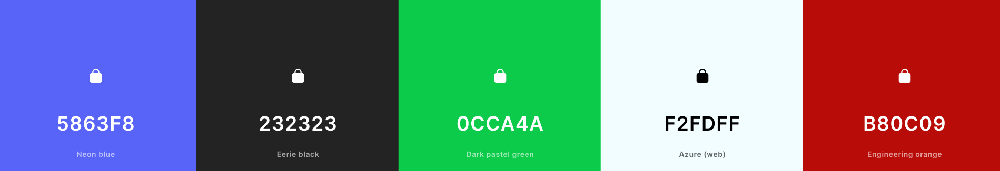
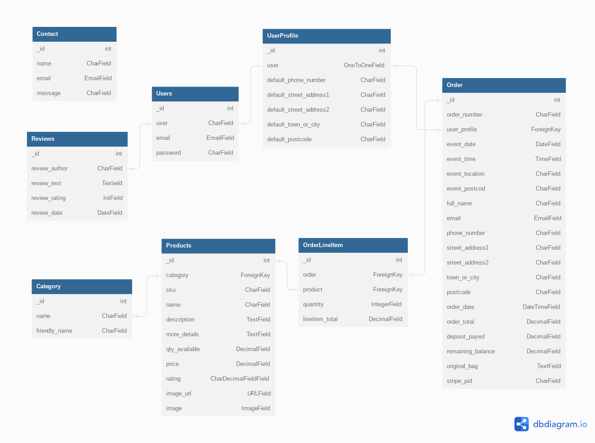

<h1 align="center">Joio Entertainment</h1>


Welcome to the booking site for Joio Entertainment - an entertainment company offering services and products for use in live events.

[View the live project here](https://joio-entertainment.herokuapp.com/).

Joio Entertainment is a locally owned company based in LLanelli, Wales. The company offers a number of services and products for use in live events, ranging from birthday parties to weddings. The company is in desparate need of a website that will handle customers bookings and payments, thus removing much of the administration responsibilities from the company owner.


# Table of Contents
* [Website Concept](#website-concept)
* [Project Goals](#project-goals)
* [User Stories](#user-stories)
    - [As a New Visitor](#as-a-new-visitor)
    - [As an Unregistered User](#as-an-unregistered-user-including-all-prior-stories)
    - [As a Shopper](#as-a-shopper-including-all-prior-stories)
    - [As a Registered User](#as-a-registered-user-including-all-prior-stories)
    - [As a Store Owner](#as-a-store-owner-including-all-prior-stories)
* [Aesthetic Design](#aesthetic-design)
    - [Site Flow](#site-flow)
    - [Wireframes](#wireframes)
        - [Desktop](#desktop)
        - [Tablet](#tablet)
        - [Mobile](#mobile)
    - [Colour Palette](#colour-palette)
    - [Images](#images)
    - [Font](#font)
* [Database](#database)
    - [Data Schema Design](#data-schema-design)
* [Technical Design](#technical-design)
* [Accessibility](#accessibility)
* [Features](#features)
    - [Interactive Elements and Features](#interactive-elements-and-features)
    - [Page Features](#page-features)
* [Technologies Used](#technologies-used)
    - [Languages Used](#languages-used)
    - [Frameworks, Libraries, Programs and Tools Used](#frameworks-libraries-programs-and-tools-used)
* [Testing](#testing)
* [Future Updates](#future-updates)
* [Deployment](#deployment)
* [Credits](#credits)

# Website Concept
This will be a fully-interactive e-commerce website, with the main purpose to drive sales and take care of administration work for the company. This will be achieved by clearly displaying the catalogue of products offered, developing a calendar booking system and providing company information to customers.

The site will also serve as an advertisement for the company, by sharing images and videos from previous events. Visitors can seamlessly browse through the websites vast range of products, through specific categories or even through personalized searches. By signing up for free, customers will be able to access additional features on the site, such as viewing upcoming bookings and posting reviews.

All website features will be documented in this README document.

The website will clearly display information for all visitors, including the company contact information via social media links and helpful customer information pages (About us, Contact Us and the relevant delivery and returns pages). The website is fully responsive on a range of devices - from hand-held devices to larger screens such as monitors and even TVs. This is to ensure that as many people as possible can visit and use the website.

The website is welcoming to a range of visitors and provides a plesant user-experience with plenty of on-screen prompts on display. A whole host of intuitive features, matched with secure technology working in the background creates a smooth, safe and efficient user-friendly experience.

The website is easily maintainable through the admin portal, but also allows admin/store owners to manage aspects of their store by just signing in to the website itself. This is of huge importance as it allows the store owner to easily update their store at any time, without having to contact their website developer. The website and the features built in to the design means it's adaptive and scalable - the store owners can add more products and in turn more user interactivity. This means that the website can develop with the company as it grows.

[Back to table of contents](#table-of-contents)

# Project Goals
This is the fourth and final project submission for [Code Institute](https://codeinstitute.net/)'s 'Level 5 Diploma in Web Application Development' course. The task is to design, build and implement a full-stack e-commerce website that incorporates Django/Python. A shopping bag and checkout app will serve as the stores purchasing method, using Stripe's online payment processing system. This will be fully functioning, secure and tested with feedback provided to the users of the website.

The projects goals are to emulate an application that's ready to launch - intending for the website to be passed over to the store owners and for them to manage the rest. 

This project provides an opportunity for the developer to showcase the backend and frontend skills acquired during the length of the course. 

The project will display proficiency in technical aspects already exposed to (HTML, CSS, JS, Bootstrap, Python to name a few) and to also fully embrace the practice of the 4th projects main study-material; Django, advanced deployment methods and security. The goals are to keep building on the skillset acquired throughout this course. Joio Entertainment will utilize a conventional relational database with a focus on CRUD functionality, implementing features available for all levels (visitor, registered user, admin). These will be apparent throughout the website, but also well covered throughout this README, TESTING & DEPLOYMENT documentation.

[Back to table of contents](#table-of-contents)

# User Stories

Following are the goals that the website should provide for each user.

| User Story ID | As a/an | I want to be able to... | So that I can... |
| --- | ----------- | ----------- | ----------- |
 | Viewing and Navigation | 
 | 1 | Customer | View a list of products and services offered | Quickly view all options and prices | 
 | 2 | Customer | View individual service/product details | Find out further information about and see further images of the listing |
 | 3 | Customer | Be able to contact the company easily and quickly | Different modes of contact that suit the occasion |
 | 4 | Customer | Learn about the company | Decide if the company is compatible with the type of event i'm planning |
 | 6 | Customer | See available dates | Know that the company is able to commit to my booking | Not achieved | 
 | 7 | Customer | See ratings and reviews | To help me make my decision |
 | Registration and User Accounts | 
 | 8 | Site User | Easily register for an account | Have a personal account and be able to see my profile |
 | 9 | Site User | Easily login or logout | Access my personal info |
 | 10 | Site User | Easily recover my password | Access my account even if I've forgotten my password |
 | 11 | Site User | Easily access my user profile | Access my account quickly |
 | 12 | Site User | Have a personalised user profile | With my personal order history and be able to update my default billing address |
 | 13 | Site User | Be able to make an account after checkout | To be able to see my booking if I haven't made one before |
 | 14 | Site User | Make an account to leave ratings and reviews | Comment on my event and help others make a choice |
 | 15 | Site User | See my ratings and reviews in my user profile | So I can see what reviews/ ratings I have left easily |
 | Sorting and Searching | 
 | 16 | Customer | Sort/ Filter services by dedicated filters. e.g. Music, photography, availability | know whats available for specific types of events |
 | 17 | Customer | Search for a service by name, description or key feature | Find a specific service I'd like to book |
 | 18 | Customer | See if there are no search results | Quickly see if nothing matches my search | 
 | Purchasing and Checkout | 
 | 19 | Customer | Be able to select the stay I want and book through the product page | Start the booking process |
 | 20 | Customer | Be able to review my bag and add or remove multiple products quickly | So I can see the changing price of my booking and what ive already added |
 | 21 | Customer | Be able to review my order details | So I can double check I have booked the right services for the right dates |
 | 22 | Customer | Easily enter my payment information | Check out quickly with no hassles |
 | 23 | Customer | Feel my personal and payment information is safe and secure | Confidently provide the needed information to make a purchase |
 | 24 | Customer | View an order confirmation after checkout | Know my order has gone through and I haven't made any mistakes |
 | 25 | Customer | Recieve an email confirmation after checkout | Keep a confirmation for my records |
 | 26 | Store Owner | Showcase featured listing | Give website visitors a quick sense of the types of listings available on my website |
 | 27 | Store Owner | Showcase featured categories | Give website visitors a quick sense of the types of categories of services available from the company |
 | 28 | Store Owner | Showcase featured reviews | Show social proof and build trust with website visitors |
 | Ratings & Reviews | 
 | 29 | Customer | To be able to add a Rating/ Review | In case I wish to add a rating and or a written review |
 | 30 | Customer | To be able to delete a Rating/ Review | In case I wish to delete a rating and or a written review |
 | 31 | Customer | to be able to edit a Rating/ Review | In case I wish to edit a rating and or a written review |


[Back to table of contents](#table-of-contents)

# Aesthetic Design
Once the User Stories and the projects intentions were set out, the next step was to design the aesthetic aspects of the website.

## Site Flow

The linked documents ( view them  ) shows the websites flow for three main possibilities:
1. Not Signed In - [Not Signed In](docs/site-flow-not-signed-in.png)
2. Signed In - [Signed In](docs/site-flow-signed-in.png)
3. Admin Signed In - [Admin Signed In](docs/site-flow-admin.png)

This is covered in greater depth throughout this README and the TESTING documentation. This is to give a quick idea on what features are available for each level from 1 (Not Signed In) having the least amount of accessibility and features to 3 (Admin Signed In) having the most.

## Wireframes
Wireframes were drawn using Balsamiq at the beginning of the project. They were referenced to throughout the design and building of the website. Following is a series of images showing the Joio Entertainment website on the three main screen sizes: mobile, tablet and desktop. Every major section of the website is also included.

### Mobile
[Mobile Homepage](docs/wireframes/mobile-home.png)
[Mobile Products](docs/wireframes/mobile-products.png)
[Mobile Account](docs/wireframes/mobile-account.png)
[Mobile Bag](docs/wireframes/mobile-bag.png)
[Mobile Checkout](docs/wireframes/mobile-checkout.png)

### Tablet
[Tablet Homepage](docs/wireframes/tablet-home.png)
[Tablet Products](docs/wireframes/tablet-products.png)
[Tablet Account](docs/wireframes/tablet-account.png)
[Tablet Bag](docs/wireframes/tablet-bag.png)
[Tablet Checkout](docs/wireframes/tablet-checkout.png)

### Desktop
[Desktop Homepage](docs/wireframes/desktop-home.png)
[Desktop Products](docs/wireframes/desktop-products.png)
[Desktop Account](docs/wireframes/desktop-account.png)
[Desktop Bag](docs/wireframes/desktop-bag.png)
[Desktop Checkout](docs/wireframes/desktop-checkout.png)

## Colour Palette

The Joio Entertainment website colour palette is predominantly dark, using bright "neon" colours which stand out against either a black or white background. The dark colours used for the header and footer match the company's images and reflects the style of a party or special events where the company usually operates.

Dashes of brighter colours are present for the interactive elements in an effort to highlight these and to make a drastic contrast between said interactive elements and other non-interactive content. 

Although a black colour is used for certain elements of the site, it was decided that the body of the website should have a white colour, which allows the products and the main information on the pages to stand out more clearly.



The main background image for the homepage reflects the colours used on the site and shows off some of the products that are offered by the company as soon as the user opens the site. 

The main text colour throughout the website is a dark grey. The page headings, page text and information use this. This creates a constant and obvious contrast between the much lighter background. The website's navbar and buttons almost all use a white text, always set against dark backgrounds. This is to ensure maximum readability and to draw the users eyes to focus on what's important - the products and buttons. 

By default, all buttons have a consistent style, size and layout throughout the website. See more in the buttons [Features](#features) section.

Some text colour changes are seen throughout the website - red, usually reserved for error or validation purposes to grab the users attention. A neon blue is used for links and for the backround colour of general buttons to again help with contrast. 


## Images

The use of images is vital in creating a professional appearance for the company. Users are drawn by what they see. The background image on the homepage dominates the screen and draws the attention of new visitors. The product images are clearly displayed and well spaced on the product informantion pages. These images are responsive at different screen sizes. The high quality images will encourage visitors to continue browsing the website, and assure them of the quality of the products and services on offer.

It's vital for the theme to be clear and obvious. The background image makes the website recognizable and memorable so visitors recall and return to it, which in turn will draw more eyes to the website. This, along with the CSS styling, colour palette and branding solidifies the theme.

## Font

The Joio website uses the 'Montserrat' font. It provides that clean and clear style without compromising on readability - a vital design feature for any website. This is available for free via [Google Fonts](https://fonts.google.com/). Sans Serif is used as a secondary option in case of failure to load the font into the website correctly. Poppins is a font often used in designs, so it is both attractive and appropriate.

There are some stylistic changes to the font (the use of ```<strong>```), but mostly with just colour changes for impact, attention or contrast and readability purposes.

When the underline animation appears underneath the navbar text on cursor hover, they serve as hints to the user that that element can be interacted with.

[Back to table of contents](#table-of-contents)


# Database
The Joio Entertainment website uses a relational database.

Locally, Django's built-in SQLite database was used during development.  

For the deployed live version, the website is set up to use ElephantSQL's postgres database.

## Data Schema Design
Here is the Database Schema layout for the Joio website:



It shows each model present in the project and the relationship between them.  
This schema is essential for developing the website's functionality, its features and what users are capable of doing..

### Model breakdown:  
- User - django's built-in [User](https://docs.djangoproject.com/en/4.1/ref/contrib/auth/#user-model) model. Uses Django's [allauth](https://django-allauth.readthedocs.io/en/latest/installation.html) application to deal with account authentication, registration and management. Contains user information such as username, password, email.
- UserProfile - extends through django's User model. It contains user information that will be stored on the My Profile page and made available for the user when filling in the Checkout form. Connects to the User model.
- Order - It contains all the information relating to the users order and history. Connects to the UserProfile and OrderLineItem model.
- OrderLineItem - It contains information relating to an order and its items. Connects to the Product and Order model.
- Product - It contains all of the information relating to a product found on the website. Connects to OrderLineItem and Category.
- Category - It contains all of the information relating to a category. Related to products for filtering and sorting. Connects to the Product model.

[Back to table of contents](#table-of-contents)

# Technical Design

Once the user goals, the projects intentions and aesthetic design were set out, the next step was to design the technical aspects of the website.

## Defensive Programming
Accessibility, authorization and security levels can be controlled by combining django's authentication system found [here](https://docs.djangoproject.com/en/4.1/topics/auth/default/) and a other technical features written in custom code for the Joio website.

The UserProfile model and django's User model are referenced on the backend in the views.py files and again in the templates.


The `@login_required` decorator is used as another line of defence. Thie is found within the views files. This decorator limits access and secures these views to only signed in users. It is present for:
- Adding a product.
- Editing/Updating a product.
- Removing a product.
- Accessing the My Profile page.

Further accessibility is given to admin/storeowners/superusers, for example:
```
if not request.user.is_superuser:
    messages.error(request, 'Sorry, only store owners can do that.')
    return redirect(reverse('home'))
```
The above code applies to adding, editing and removing the products from the website and prevents anyone other than those granted the highest accessibility levels. This stems from the User model by using `is_superuser`.


## Custom Error Pages
Django will use the custom `404.html` and `500.html` templates created for the Joio Entertainment website whenever an error occurs. These contain a small message informing the user of the issue, and a link back to the home page.
- 404 page: user is presented with this page when they attempt to access a page that does not exist.
- 500 page: user is presented with this page when there is an internal error.

## Form validation


Form validation is handled from the very beginning by defining the models fields and then building upon that. Forms are constructed in the `forms.py` files and can be targeted with python code in `views.py`, using the `is_valid()` method to return true or false. Templates with custom validation through HTML and JavaSript/jquery also handle validation and the use of Cross Site Request Forgery (CSRF) on forms adds security.

Users are prevented from submitting invalid forms and are informed of this in multiple ways:
- Invalid popup message next to affected inputs such as for the add products and checkout forms.

- Red text message appears under or next to input, such as for the card payment field.

- Allauth also handles validation for such forms as log-in, log-out and sign up.

## Django-Allauth

Used for the user account authentication to ensure that security was always at the forefront of the design and implementation.

## Image Handling

Using Django's templating language, the product pages load and check to see if an image is present. If that fails, a backup image is used as a default: 

The store owner has the ability to edit the product from the website or the admin portal in case image issues arise. This is the image used for any image failures:


## Toasts

Toasts provide a great user experience to inform users of actions across the website, whilst the logic is handled and wrapped up in code on the backend. They appear at the top of mobile screens and at the top-right of larger screens whenever necessary. They can be easily dismissed by the user by clicking on the small close/x button on the toast itself.

After creating the project, django automatically enables [messaging](https://docs.djangoproject.com/en/4.1/ref/contrib/messages/) functionality in the `settings.py` file, through the `django.contrib.messages` found in the INSTALLED_APPS section. These were linked to custom messages levels, setup in `base.html` and then custom text was added when creating the views:

`messages.success(request, f'{product.name} review removed!')`

There are four different types of toast messaging used on the site:

### toast_success = Success!

To confirm an action the user requested and has succeeded in doing so. These include but are not limited to scenarios where the user has:
- successfully added a product.
- successfully edited/updated a product.
- successfully removed a product.
- successfully added an item to shopping bag.
- successfully signed in.
- successfully signed out.
- successfully signed up.

### toast_error = Error!

- an action was not successful or some other failure occurred e.g. performing a search without any input.
- user attempts to manually access the checkout page, without any items in the shopping bag.

### toast_info = Alert!

- inform the user when they are editing a product review.
- inform the admin when they are editing a product.

### toast_warning = Warning!

- A failure did not occur but may be imminent

## Modal
Modals act as a simple reminder to check if the users actions were intended and thus create a great user-friendly experience. Modals prompt the user to think again and to confirm or cancel the action so that they can be certain or even to avoid making a mistake A modal is used to notify the Admin users that they are about to delete a product or service. It reminds them that the delete is permanent and asks them to click again if they are sure they want to delete. The button in the modal itself deletes the related data:

## Email
The website uses Gmail to send company information and account-related emails. These emails use Django's template language to personalize each email from a basic txt document. They are sent for reasons such as to confirm orders have been successful, or to reset passwords.

## Stripe
Stripe is used to securely handle card payments. Further information regarding Stripe's role in this project can be found throughout this documentation, especially in the [TESTING](TESTING.md) and [DEPLOYMENT](DEPLOYMENT.md) sections.

## AWS
Further information regarding the AWS (Amazon Web Service) role in this project can be found throughout this documentation, especially in the [TESTING](TESTING.md) and [DEPLOYMENT](DEPLOYMENT.md) sections. S3 Bucket service is used to handle static images and styling. IAM is used to handle authorization and access.

[Back to table of contents](#table-of-contents)

# Accessibility
The website considers accessibility in a number of ways, including:-

- Semantic design.
- The use of alt to describe images and other content.
- Aria-labelledby to link sections.
- Colour and contrast considerations and testing.
- Adding labels to forms.
- Prompts to help guide users.

[Back to table of contents](#table-of-contents)

# Features

## Interactive Elements and Features

Following is a list of all interactive elements and features found on the website:

### Navbar

- Fully-responsive nav bar (including mobile nav bar) accessible on all pages of the website
- Clear and obvious navbar links to other pages within the website, including mouse-hover effects to enhance the users experience.
- The Joio logo is seen at all times at the top left corner of the page. This is vital for brand consistency and serves as a simple way of reminding the user of the company's name. The logo/name is clickable and always takes the user to the homepage.
- 'Account' symbol, which when clicked reveals a menu for 'Sign In', 'Sign Up' or 'Sign Out' depending on if user is signed in or not. 'Product Management' (for admin only) and 'My Profile'. All direct to the relevant pages.
- Shopping Bag. Logo turns green when there are items in the bag. Takes user to the shopping bag page when clicked.

### Footer
 
- Fully responsive footer which closely matches the design and colour palette of the top navbar.
- Important links in footer, including contact number and email link.
- Facebook social link in footer, linking to the companys facebook accounts 

### Buttons

The buttons serve as triggers for users to achieve something they wish. An action is called on those buttons and are linked on the back-end.

The buttons have a uniform and simple design to create consistency in their functions and to make it easy for the user to understand and use the website.

Buttons are either green or neon blue, with the 'Remove' product button reserved for red - a choice purposefully made so that they stand out amongst the normal links and buttons.

The green buttons are used to direct people towards a sale. Green is used because it is considered the colour for "GO". This is used for adding product to bag, going to view the bag page, the checkout page, and finally for the Confirm payment button. 

The vast majority of buttons have a hover state of black text colour and darker bacground colour. This is to easily notice the change in button style state when hovering a mouse over the screen, making it clear that the link/button can be interacted with.


### Quantity Selector

This feature is present on the Product Detail page and the Shopping Bag page. It serves as a way to quickly and easily change the number of each product that the shopper wishes to purchase. Features are:
- Minus (-) button signifies subtracting one item at a time when clicked.
- Plus (+) button signifies adding one item at a time when clicked.
- Type the number, use the +/- buttons or use the up/down quantity selector inside the input to decide on the chosen number.
- Validation to only allow a minimum of 1 item and a maximum of the number of this item that is available in stock. Users are informed of any issues with on-screen validation prompts.


### Shopping Bag Preview

- This is a popup that appears at the top of the page when users make any adjustments to the items in their product. It serves as a handy reminder of what their shopping bag contains, without the need to visit the shopping bag page on each adjustment. Features include:
- A toast message informing users of the change in their bag (add/remove/update).
- Number to signify the total number of items in the bag.
- Small images of the products chosen.
- Quantity of each item in bag.
- The cost of those items, excluding delivery charge.
- 'Go To Secure Checkout' a button when clicked will take the user straight to the Checkout page.


### Interactive Toasts

- Messages appearing at the top of the webpage whenever a user or admin completes a task - by either adding, editing or deleting information. Toasts also appear when website navigation isn't possible e.g. accessing checkout with no items in bag. They are informed of this.

## Page Features

There are universal features that are present throughout the website. These features are:
- Navbar, explained [here](#navbar).
- Footer, explained [here](#footer).
- Buttons, explained [here](#buttons).
- Toasts, explained [here](#interactive-toasts).
- All clickable images, buttons, links etc have a hovering cursor to signify that the element can be interacted with. The majority of these elements are visually prompted either through a short animation, colour change or highlighting.
- Back-to-top button. Guides the user back to the top of the page once interacted with. Useful for pages with lengthy content.

Here's a breakdown of all the design features on each of the main webpages within the Joio website:

### - Home page

The home page for the Joio website. All visitors will be welcomed by this page. The features include:
- A full-screen background image, and a button that leads to the products page.

### - The Products pages

This is where every product on the website is listed. All visitors to the website can view this webpage, whether they are registered or not. The features include:
- Page title located at top of page, just under the navbar.
- Button that allows user to filter the products into categories.
- A list of every product on the website presented in a card format, with product image, name, price and related category, with an add to booking button that adds one of the item to the bag.


### - Product Detail page
 
The Product Detail page is where the user can see the full product details for the product they selected. All visitors to the website can view this webpage. The features include:
- Product Name.
- A large image of the product, that can be clicked on again to see it's original quality and size.
- All product information presented, which includes product price, rating, category, sku, description.
- [Quantity selector](#quantity-selector) to choose how many items to add to the Shopping Bag.
- Product rating.
- If the admin/store owner is signed in, the 'Edit Product' button appears beside the product detail information and forwards the admin/store owner to the 'Edit Product' (/edit/product_id/) page.
- If the admin/store owner is signed in, the 'Delete Product' button appears beside the product detail information and once clicked allows the admin/store owner to remove the product from the website. Before doing so, the admin/store owner is met with a modal that asks for confirmation on whether they want to delete that product or not. Admin/store owner must click 'Delete' again to confirm this (which will then remove the product from the website and the database), otherwise, they can cancel by clicking the 'Cancel' button.
- The 'Edit Product' and 'Remove Product' are both hidden if not the admin/store owner.
- The 'Keep Shopping' button will return the user back to the main products page when clicked.
- The 'Add to Bag' will add that product to the users shopping bag when clicked.

### - My Profile page

My Profile. This is where the users personal information is stored. Only registered users can view this page. The features include:
- Page title, including the users username at the top of the page.
- An editable form that is either empty or contains previously saved user information including delivery address.
- 'Update Information' button, when clicked will update the form and save that information to user profile.
- A table of previous orders, with a clickable link to see the full order details.

### Product Management - Add Product page

The Add Product page is for the admin/store owner to add their products website via a form. Only admin/store owners can use this feature. The product is added to the main products page and is available on all relevant pages that the categories, rooms and specials apply to. It will also be searchable in the search bar for user-inputted queries. The features include:
- Page title and form title at top of page.
- Validation on all inputs.
- All inputs linked to the database.
- Category dropdown - Choice of selectable options. The 'Category' section the product will be placed in. Allows users to search and filter by this. Listed on product pages and product details page. Admin has control over which categories are added to the website/database.
- SKU input - The product sku number that will be presented for all to see on the product detail pages.
- Product Name input - The product name that will be presented for all to see on all of the product pages.
- Short Description input - A text input to accept the admins description of their product. It will be presented for all to see on the product pages.
- Product Price input - The product price that will be presented for all to see on all of the product pages.
- Ability for admin to upload a product image. This is validated and has some error handling linked to it.
- Product Description - A text input to accept the admins longer description of their product, for example, specific tetails that do not need to be mentioned on the products page.
- 'Add Product'. This button submits the form to the website/database if all inputs are valid and met. Admin is informed of product addition via toast. The product is then added to the website and can be viewed, searched for, edited, removed etc.
- 'Cancel' button. Leaves the page and returns to the main products page.

### Product Management - Edit Product page

The Edit Product page is for admin to edit the chosen product via a form. Only the store owner/admin can use this feature. The edited product is updated when the form is submitted and found in the same places as the original product. The information expected from the admin is the same as the Add Product page. The features include:
- Validation on all user inputs.
- All inputs seen on Add Product page, with all inputs presented again. The current product details will be populated in each input, ready to be edited.
- 'Update Product'. This button submits the form to the database if all inputs are valid and met and updates that specific product.
- 'Cancel' button. Leaves the page and returns to main products page.

### - Shopping Bag page

The Shopping Bag is the page where users add their products to, before advancing to the checkout. The features include:
- Page title at top of page.
- A list of products with each product info containing the image, the name, the sku number, the price, the quantity and subtotal.
- A [quantity selector](#quantity-selector) which then updates the bag total, delivery cost and grand total once updated/ or items are removed from bag.
- 'Remove' button, when clicked will update the number of items the user has chosen.
- 'Update' button, when clicked will remove the item from the shopping bag instantly.
- Bag Total - the total amount in GBP (£) of the items in the bag.
- Grand total - the grand total of bag total and the delivery in GBP (£).
- 'Keep Shopping' button which directs user back to the main products page when clicked.
- 'Secure Checkout' button which directs user to the Checkout page when clicked.


### - Checkout page

The Checkout page is where users give their event information, delivery information and payment details before confirming the purchase. The features include:
- Page title at top of page.
- Form for user details that include Full Name and Email.
Form for event information, including location of event and time and date. Event postcode is optional
- Form for customer information that includes 'Phone Number', 'Street Address 1', 'Street Address 1', 'Town or City, 'Postal Code'.
- Save Delivery checkbox. Feature only available to those signed in. Feature to save current form details for future use. Links to Sign In or Sing Up if user not signed in.
- Payment input for card payment and validation. Uses Stripe to check. Takes long card number, expiry date and CVC secure number.
- Form with full validation.
- Order Summary with details of products and cost.
- Order Total - the total amount in GBP (£) of the items to purchase.
- Deposit total - the deposit cost in GBP (£). Charged at 50% of the order total, or £500, after the cost of the bag rises above £1000.
- Remaining balance - the remaining balance in GBP (£) that remains payable on the day of the event.
- 'Adust Bag' button, to return to Shopping Bag on click.
- 'Complete Order' button. Users will click this button to confirm all and authorize the purchase. Take them to Checkout Success page if valid, otherwise returns here.
- Text message underneath buttons to inform user of the charge to their card when processed.


### - Checkout Success page
The Checkout Success page is where users get a confirmation of their order details after a successful purchase. The features include:
- 'Thank You' page title at top of page.
- A message to say that all details are forwarded to the given email.
- Order info including order number limited in size, for security purposes. Message informing customer that full number will be in their email.
- Order date, event location, time and date details of services ordered, address, phone number and costing.


### - About Us page

This page contains a small back-story of the Joio company.

### - Contact page

This page contains contact information and social media links ot the company. Page title, text and links against the background image found on the homepage.


### - Sign In page

The Sign In page is where visitors can enter their details and sign in to their account. All visitors to the website can view this webpage. The features include:
- 'Sign In' title on top of the page.
- A link to Sign Up if the are not a registered user.
- Username or email input with placeholder and validation applied.
- Password input with placeholder and validation applied.
- A 'Remember Me' checkbox that can be checked/ticked. This feature saves the users details, and will auto-populate the inputs for the next time they visit this page. 
- 'Sign In' button. When clicked, the user is signed in to the website and forwarded to homepage, with a Success! toast informing them of their successful sign in.
- 'Home' button. When clicked, the user is signed in to the website and forwarded to homepage.
- 'Forgot Password?' link. When clicked, the user is directed to the [Password Reset](#password-reset) page.

### - Sign Out page

The Sign Out page is where visitors are asked to confirm if they'd like to Sign Out of the Joio website, having already clicked on the Sign Out link from the My Account menu.
Features include:
- Sign Out title on top of the page.
- Text above buttons to ask if user is sure they'd like to sign out.
- 'Sign Out' button. When clicked, will sign user out of their account and lead them back to the home page.
- 'Cancel' button. When clicked, the user is taken to the homepage, but remains signed in to their account.

### - Sign Up page

The Sign Up page is where visitors can enter their details for the first time to register their new account. All visitors to the website can view this webpage. The features include:
- 'Sign Up' title on top of the page.
- 'Sign in' link underneath. Directs users to Sign In page on click. Useful link for those who want to sign in, and already have an account.
- 'Email address' input with placeholder and validation applied.
- 'Email address confirmation' input with placeholder and validation applied.
- 'Username' input with placeholder and validation applied.
- 'Password' input with placeholder and validation applied.
- 'Password (again)' input with placeholder and validation applied.
- 'Sign Up' button. When clicked, the user is forwarded to the 'Verify Your E-mail Address' page. They must verify the link in their inbox to access their account.
- 'Back to Sign In' button. When clicked, the user is taken to the Sign In page.

### - Verify Your E-mail Address

The 'Verify Your E-mail Address' page is where visitors are directed after they Sing Up for the first time. Users must verify their email address before they are able to access their account. If they attempt to Sign In without verifying this, they will always be redirected back to this page, with an Alert! toast informing them of the process. The features include:
- 'Verify Your E-mail Address' title on top of the page.
- Text to inform user of the process.

### - Password Reset

The Password Reset page is where visitors enter their email address to reset their password. A link will be sent out to the uses email inbox. The user must click that link to reset their password, allowing them to regain access to their account. All visitors to the website can view this webpage. The features include:
- 'Password Reset' title on top of the page.
- Email address input with placeholder and validation applied.
- 'Reset Password' button. When clicked, will activate the restet password process.
- 'Back to Sign In' button. When clicked, the user is taken to the Sign In page.

[Back to table of contents](#table-of-contents)

# Technologies Used
## Languages Used

-   [HTML5](https://en.wikipedia.org/wiki/HTML5)
-   [CSS3](https://en.wikipedia.org/wiki/Cascading_Style_Sheets)
-   [JavaScript](https://en.wikipedia.org/wiki/JavaScript)
-   [Python3](https://en.wikipedia.org/wiki/Python_(programming_language))


## Frameworks, Libraries, Programs and Tools Used

1. [Django:](https://docs.djangoproject.com/en/4.1/releases/3.2/)
    - Django is the framework. Version 3.2.
1. [Django-allauth:](https://www.intenct.nl/projects/django-allauth/)
    - Django app that allows for both local and social authentication.
1. [Google Fonts:](https://fonts.google.com/)
    - Google fonts is used to import the fonts into the style.css file which is used on all fonts within the website.
1. [Font Awesome:](https://fontawesome.com/)
    - Font Awesome is used on all pages throughout the website to add icons for aesthetic and UX purposes.
1. [jQuery:](https://jquery.com/)
    - jQuery is used to simplify and manipulate some tasks instead of regular JS.
1. [Git:](https://git-scm.com/)
    - Git is used for version control by utilizing the Gitpod terminal to commit to Git and Push to GitHub.
1. [GitHub:](https://github.com/)
    - GitHub is used to store the projects code after being pushed from Git.
1. [Gitpod:](https://gitpod.io/)
    - Development environment to build the website.
1. [Balsamiq:](https://balsamiq.com/)
    - Balsamiq is used to create the [wireframes](#wireframes) during the design process.
1. [Eye Dropper:](https://eyedropper.org/).
    - This colour picker tool was used to to pick and experiment with colours.
1. [Coolors:](https://coolors.co/)
    - This tool was used to setup the colour palette [here](#colour-palette).
1. [WPS Office:](https://www.wps.com/)
    - WPS Office is used to create the tables found in the [testing](TESTING.md) document and for spell-checking.
1. [Grammarly:](https://app.grammarly.com/)
    - Grammarly is used for spell-checking..
1. [PsycoPG2:](https://pypi.org/project/psycopg2/)
    - PsycoPG2 is a database adapter. Library for connecting Python to PostgreSQL.
1. [Bootstrap:](https://getbootstrap.com/docs/4.6/getting-started/introduction/)
    - Bootstrap version 4.6. Used for building responsive font-end content and styling.
1. [Heroku:](https://www.heroku.com/)
    - Used to deploy the website. Initially used for it's database capabilities too.
1. [ElephantSQL:](https://www.elephantsql.com/)
    - ElephantSQL is used for hosting the PostgreSQL database. 
1. [Stripe:](https://stripe.com/gb)
    - Stripe. Card payment processing, security features and webhooks.
1. [AWS:](https://aws.amazon.com/)
    - AWS is used for storing images and static files.
1. [pip:](https://pip.pypa.io/en/stable/)
    - An installer for Python.

A full list of the requirements necessary to install is covered in the [deployment](#deployment) section.

[Back to table of contents](#table-of-contents)

# Testing

Due to the extensive testing necessary for the Joio Entertainment website, the full documentation can be found here - [TESTING](TESTING.md).

[Back to table of contents](#table-of-contents)

# Future Updates
There are many planned updates arranged for the Joio Entertainment website that include but are not limited to:

* Introduction of more social features such as:
    - Social media links to share, comment and link.
    - Link email for subscription, email, newsletters etc.
* Link social media for signing in/signing up, subscription, e-mail etc.
* More user features.
* More admin/superuser rights from the website itself (not just the admin portal):
    - Create, Edit, Delete Categories.
    - Create, Edit, Delete Rooms.
    - Create, Edit, Delete Specials.
* Photobook purchasing from photography stands.

[Back to table of contents](#table-of-contents)

# Deployment

Deployment documentation can be found in a separate folder located here - [DEPLOYMENT](docs/DEPLOYMENT.md).

[Back to table of contents](#table-of-contents)

# Credits
## Code
- Code Institute's Boutique Ado tutorial forms the basis of this project.
- Code credit is found throughout the documentation whenever possible.
- Code from official sources related to each service used. e.g. Django-Allauth, Stripe, Bootstrap.
- A [privacy policy generator](https://www.privacypolicygenerator.info/) was used and linked in the Delivery Info and Refunds pages.

## Content & Media

All images are copyright-free.

- The noimage `noimage.png` image was taken from Code Institute's Boutique Ado tutorial repository. 

- Every other image was supplied by the owner of Joio Entertainment who was happy for them to be included in the project.

[Back to table of contents](#table-of-contents) -->

## Acknowledgements

- Stack Overflow [website](https://stackoverflow.com/) for general problem solving.

- Code Institute's Slack community.

- Tutor support at Code Institute.

[Back to table of contents](#table-of-contents)

This project is for educational purposes only.