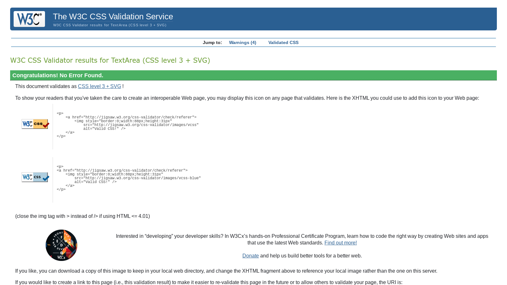

# Testing

The Joio Entertainment website has been tested using the following methods:
- [Code Validation](#code-validation)
    - [W3C HTML Validator](#w3c-html-validator) 
    - [W3C CSS Validator](#w3c-css-validator)
    - [JSHINT Javascript Code Quality Tool](#jshint-javascript-code-quality-tool)
    - [Python Validation using Gitpod](python-validation-using-gitpod)
- [Lighthouse](#lighthouse)
- [Responsiveness](#responsiveness)
- [Testing User Stories](#testing-user-stories)
    - [First Time User](#first-time-user)
    - [Returning User](#returning-user)
    - [Business Owner](#business-owner)
- [Manual Testing](#manual-testing)
- [Bugs](#bugs)
    - [Resolved](#resolved)
    - [Unresolved](#unresolved)

# Code Validation

## W3C HTML Validator

The Joio Entertainmet website pages passed all tests using the W3C HTML Validator tool

Links to images of tests:
<h2 align="center"></h2>

<h2 align="center"></h2>

<h2 align="center"></h2>

<h2 align="center"></h2>

<h2 align="center"></h2>

<h2 align="center"></h2>

<h2 align="center"></h2>

<h2 align="center"></h2>

<h2 align="center"></h2>

<h2 align="center"></h2>

<h2 align="center"></h2>

<h2 align="center"></h2>

When first tested, every page had a Warning notification for an unnecessary attribute. This was removed and following that, all pages passed the html checks.

<h2 align="center"></h2>

## W3C CSS Validator

The Joio website passed all tests using the W3C CSS Validator tool

base.css:
<h2 align="center"></h2>

checkout.css:
<h2 align="center"></h2>

## JSHINT Javascript Code Quality Tool

The Joio website passed all tests using the JSHint Validator tool

stripe_elements.js:

<h2 align="center"></h2>

<h2 align="center"></h2>

quantity_input_script.html:

<h2 align="center"></h2>

* There were warnings highlighted by JSHint related to using a template literal syntax. However, as the code performs correctly, it was decided this was not a concern.
* There are undefined variables that are being picked up -stripe, which is defined in another script -the $ signs which doesnt seem logical as they are not variables.

## Python Validation using Gitpod

* I have checked all Python documents using command "python3 -m flake8" in the terminal to ensure they are compliant.

* All issues were rectified, except for code I have not written in Django settings.

# Lighthouse

I used the Lighthouse reports in Google Developer Tools to examine the pages of the website for performance, accessibility, best practices and SEO.

There were some less than optimum scores for performance and SEO. These could be resolved by:
- Using next gen image formats
- Reducing unused Javascript and jQuery

## Homepage

<h2 align="center"></h2>

## All Products

<h2 align="center"></h2>

## Product Detail

<h2 align="center"></h2>

## Bag

<h2 align="center"></h2>

## Checkout

<h2 align="center"></h2>

## Profile

<h2 align="center"></h2>

## Sign In

<h2 align="center"></h2>

## Sign Out

<h2 align="center"></h2>

## Register

<h2 align="center"></h2>

## About

<h2 align="center"></h2>

## Contact

<h2 align="center"></h2>

# Responsiveness

Responsivity tests were carried out using Google Chrome DevTools. Device screen sizes covered include:
- Desktop
- Samsung Galaxy A51/71
- iPhone SE
- iPhone XR
- iPhone 12 Pro
- Pixel 5
- Samsung Galaxy S8+
- Samsung Galaxy S20 Ultra
- iPad Mini
- iPad Air
- Surface Pro 7
- Surface Duo
- Galaxy Fold

# Testing User Stories

| User Story ID | As a/an | I want to be able to... | So that I can... | Achieved on... |
| --- | ----------- | ----------- | ----------- | ----------- |
 | Viewing and Navigation | 
 | 1 | Customer | View a list of products and services offered | Quickly view all options and prices | Products Page | 
 | 2 | Customer | View individual service/product details | Find out further information about and see further images of the listing | Product detail Pages | 
 | 3 | Customer | Be able to contact the company easily and quickly | Different modes of contact that suit the occasion | Cobtact Page | 
 | 4 | Customer | Learn about the company | Decide if the company is compatible with the type of event i'm planning | About Page | 
 | 6 | Customer | See available dates | Know that the company is able to commit to my booking | Not achieved | 
 | 7 | Customer | See ratings and reviews | To help me make my decision | Product Details Page for rating, but no customer reviews. | 
 | Registration and User Accounts | 
 | 8 | Site User | Easily register for an account | Have a personal account and be able to see my profile | Register Page | 
 | 9 | Site User | Easily login or logout | Access my personal info | Log in and Log out Pages | 
 | 10 | Site User | Easily recover my password | Access my account even if I've forgotten my password | Reset Password Page & Reset Password Email | 
 | 11 | Site User | Easily access my user profile | Access my account quickly | Navigation (all pages) | 
 | 12 | Site User | Have a personalised user profile | With my personal order history and be able to update my default billing address | User Profile Page | 
 | 13 | Site User | Be able to make an account after checkout | To be able to see my booking if I haven't made one before | Checkout Page | 
 | 14 | Site User | Make an account to leave ratings and reviews | Comment on my event and help others make a choice |  Add Review Page | 
 | 15 | Site User | See my ratings and reviews in my user profile | So I can see what reviews/ ratings I have left easily | Reviews page | 
 | Sorting and Searching | 
 | 16 | Customer | Sort/ Filter services by dedicated filters. e.g. Music, photography, availability | know whats available for specific types of events | Products Page | 
 | 17 | Customer | Search for a service by name, description or key feature | Find a specific service I'd like to book | Products Page | 
 | 18 | Customer | See if there are no search results | Quickly see if nothing matches my search | Products Page | 
 | Purchasing and Checkout | 
 | 19 | Customer | Be able to select the stay I want and book through the product page | Start the booking process | Product detail Pages | 
 | 20 | Customer | Be able to review my bag and add or remove multiple products quickly | So I can see the changing price of my booking and what ive already added | Bag Page | 
 | 21 | Customer | Be able to review my order details | So I can double check I have booked the right services for the right dates | Bag Page and Checkout Page | 
 | 22 | Customer | Easily enter my payment information | Check out quickly with no hassles | Checkout Page | 
 | 23 | Customer | Feel my personal and payment information is safe and secure | Confidently provide the needed information to make a purchase | Checkout Page | 
 | 24 | Customer | View an order confirmation after checkout | Know my order has gone through and I haven't made any mistakes | Order Confirmation Page and Profile Page | 
 | 25 | Customer | Recieve an email confirmation after checkout | Keep a confirmation for my records | Email sent automatically after order | 
 | Home Page | 
 | 26 | Store Owner | Showcase featured listing | Give website visitors a quick sense of the types of listings available on my website | Homepage | 
 | 27 | Store Owner | Showcase featured categories | Give website visitors a quick sense of the types of categories of services available from the company | Homepage | 
 | 28 | Store Owner | Showcase featured reviews | Show social proof and build trust with website visitors | Reviews page link on homepage | 
 | Ratings & Reviews | 
 | 29 | Customer | To be able to add a Rating/ Review | In case I wish to add a rating and or a written review | Add reviews page | 
 | 30 | Customer | To be able to delete a Rating/ Review | In case I wish to delete a rating and or a written review | Reviews page | 
 | 31 | Customer | to be able to edit a Rating/ Review | In case I wish to edit a rating and or a written review | Edit Review page | 

# Manual Testing

## Navigation

- All the main navigation buttons have been tested and proven to work, with the exception of the Reviews button - app yet to be created.
- User permissions have been tested and proven to work

## Footer

- Social and contact links in the footer have been tested and proven to work

## Homepage

- All buttons and links have been tested and proven to work

## Products & Filters

- Filters have been tested and proven to work
- Search bar tested and works
- Links have been tested and proven to work

## Bag

- Bag renders as expected with one or more products added to bag 
- Buttons have been tested and proven to work
- Bag renders as expected with no items in bag
- Items can be modified and removed from the bag

## Checkout

- Bag renders as expected
- Signed in user can save information to profile
- Invalid card details error messages appear if theres an issue

## Order Success

- Order success page renders as expected

## User authentification

- Register, log in and log out pages render as expected
- Non-authenticated users cannot access user profile, they are redirected to log in

## User Profile

- User profile renders as expected
- Links are tested and proven to work
- Users can update their information from the form.

## Reviews

- Reviews page, edit review and add review papges render as expected
- The edit and add review forms change or add a review to the admin section
- All reviews are displayed on the reviews page clearly and in order of newest to oldest

## Contact

- Contact page renders as expected
- The contact form is submitted correctly to the admin section
- The user is notified immediately if the message has been successfully sent or not in the messages section

# Bugs

## Resolved

### Logo image not appearing on site
* It was first thought that I had made a mistake with the image file path but later realised that the path was not written using Django syntax.

### Failing payment_intent.successed Webhooks

* Stripe was linked and the majority of my webhooks were passing. However, my payment_intent.succeeded was failing and I was getting 500 errors. 

* I finally realised that the customer info and billing info fields automatically requested by the webhook were different to the fields in my checkout form. by commenting out the unused fields in the webhook form, I finally managed a successful webhook and in turn deleted these fields from the webhook file.

### Data not appearing in AWS storage

* After correctly undertaking the migration steps to use the external storage, the data was not appearing within AWS.

* It was finally realised that the custom_storages.py file was not spelled correctly.

### Website crashed after adding Contact page

* It was finally realised that I had not added the views.py file necessary to complete the page creation.

### Bootstrap dropdown menus were not clickable

* Discovered that the scripts had somehow been copied twice into base.html.  The extra lines were erased and re-ordered which fixed the issue.

* It was possible to add more products than that which are available in stock. This could be done by going back to the same product page and adding the maximum number available once again to the bag. 

* This was resolved by adding a piece of code that checked the "product quantity available" field in the product form and compared it with the number of the product that was trying to be added to the bag.

* Now, if the number of products in the bag become higher than that which were available, the user gets a pop-up message that notifies them that they are attempting to add too high a quantity and tells them how many are actually available on that day.

### homepage not rendering on live site

* Discovered that the 500 error was being caused by a piece of code related to the reviews section that had been placed inside the views.py file of the home app.

* once deleted the hompage rendered correctly

## Unresolved

### Unable to pass event location and date info through webhook

* Whilst creating the webhook I attempted to add information regarding the event date and location to the webhook handler.

* To begin I tried to add the data into empty fields in the billing information fields but since there were date and time fields I believe that this was creating 500 errors when webhook was attempted.

* I tried to code some variables to convert these fields to strings but the errors continued

* I tried to add these fields as metadata, using some advice I had found on stack overflow but this didnt appear to work.

* For now I have changed the fields in the Order model to null=True, blank=False. this way, the information is required in the form that the customer fills out on the checkout page but they are not required in the backend, meaning that if the order does have to be created by the webhandler, the event info is not recorded. 

* This is a situation  I will need to spend time researching, as I'm sure it is possible to add the info within the metadata of the webhook, but I have thus far been unable to work out how. Due to the time constraints of the project, the current solution was deemed to be the best one.

* Print statments showing me something was wrong with 500 error in stripe.
<h2 align="center"></h2>

### Checkout first and last names fields not auto-populating

* User and User Profile has no first or last name fields, so these fields in the checkout form are not populated. This makes it more time consuming for logged in users who have saved all their other information to go through checkout.

* A way to resolve this would be to add a First and Last name field to the user profile.

### Plus and minus fields do not stop adding numbers when item stock limit is reached

* This feature was working correctly when I built the product details page.

* Having modified the code related to these buttons to improve functionality, this specific feature seems to have stopped working.

* Due to time constraints the issue could not be solved, however if the user attempts to add a quantity that is highet than the stock number for the product, they are shown a notification and the product cannot be added until the number is changed

Back to [README.md](/README.md#testing)
